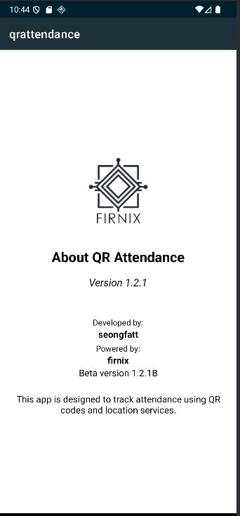
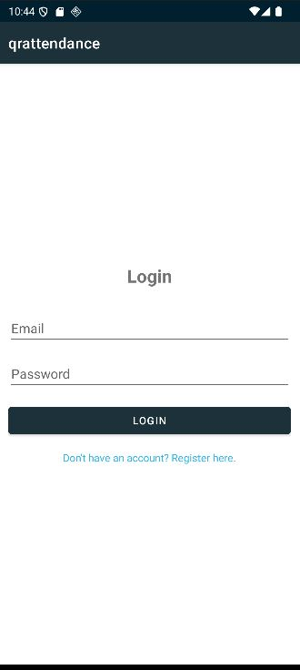
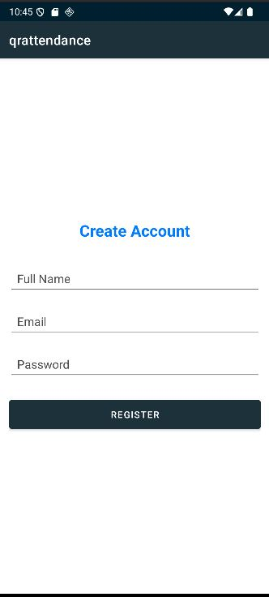
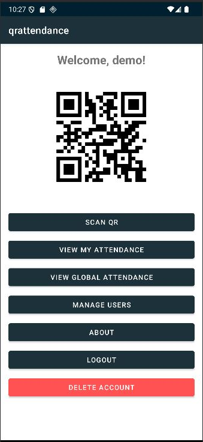
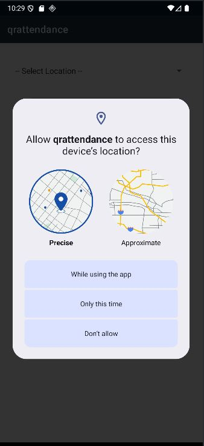
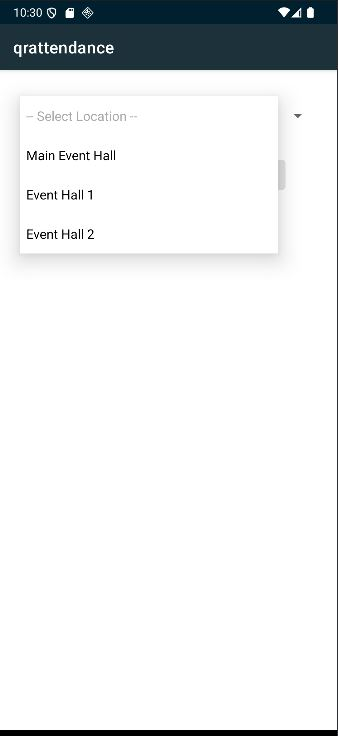
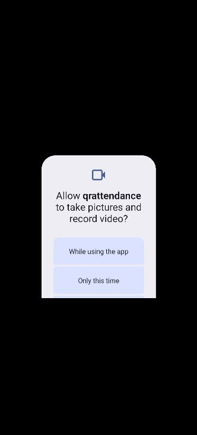
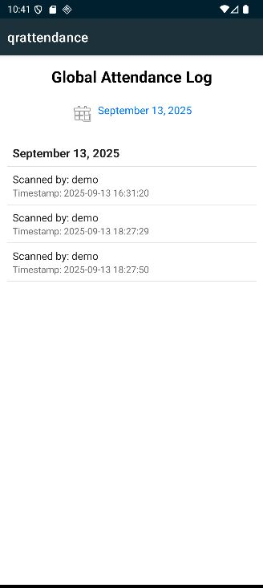
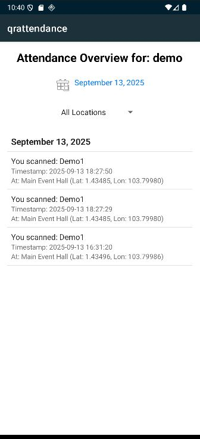
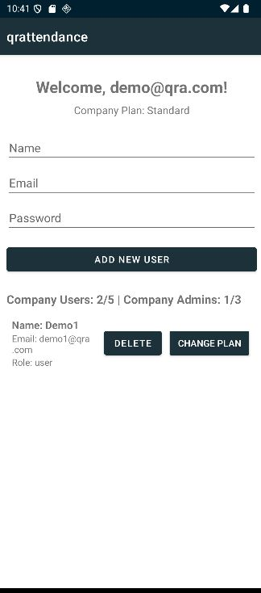

# 📲 QR Attendance System – Visual Flow Guide

Welcome to the QR Attendance System! This guide walks you through the full attendance workflow using real screenshots from the app. Each step is GPS-verified, secure, and designed for smooth operator experience.

---

## 🎬 1. About the System

  
Say goodbye to messy sign-in sheets. This system ensures attendance is recorded only when the operator is physically present at the correct location.

---

## 🔐 2. Login & Authentication

  
Operators log in using secure credentials to access the QR scanning interface.

---

## 📝 3. User Registration

  
Users are registered and assigned unique QR codes tied to their User ID.

---

## 🧭 4. Location Selection

  
Operators select the current event location from a dropdown menu (e.g., “Main Hall”).

---

## 📍 5. GPS Geo-fencing Validation

  
The app checks if the operator is within the GPS radius of the selected location.  
If not: `"Too far from [Location Name]"` is displayed.

---

## 📷 6. QR Code Scanning

  
Once validated, the operator scans the user’s QR code using the device camera.

---

## ✅ 7. Attendance Confirmation

  
If the scan is successful and location is valid, attendance is recorded with a confirmation message.

---

## 🧾 8. Data Logged to Firebase

| Field             | Description                          |
|------------------|--------------------------------------|
| `scannedUserId`  | ID of the attendee                   |
| `scannerUserId`  | ID of the operator                   |
| `timestamp`      | Date and time of scan                |
| `latitude`       | Operator’s GPS latitude              |
| `longitude`      | Operator’s GPS longitude             |
| `eventLocation`  | Selected location name               |

Stored in:

- `attendance_logs/{scannedUserId}/{uniquePushId}`  
- `global_attendance_log/{uniquePushId}`

---

## 📅 9. View Attendance History

  
Users can view their attendance history filtered by date and location.

---

## 🧩 10. Extra Modules (Optional)

- **VGA Module** – Custom visual analytics  
  

- **VMA Module** – Attendance metrics dashboard  
  

- **MU Module** – Multi-user scan interface  
  

---

## 🎯 Why Clients Love It

- ✅ No fake check-ins  
- ✅ Easy setup and secure scanning  
- ✅ Real-time data for reporting  
- ✅ Works great for events, schools, and teams

---
