# 📲 QR Attendance System – Introduction & Visual Walkthrough

Welcome to the QR Attendance System! This mobile app ensures secure, GPS-verified attendance tracking using QR codes. Whether you're managing a conference, classroom, or corporate event, this system makes check-ins effortless and honest.

---

## 🎬 About the System

  
Say goodbye to messy sign-in sheets. This system ensures attendance is only recorded when the operator is physically present at the correct location.

---

## 🔐 Login & Authentication

  
Operators log in using secure credentials to access the scanning interface.

---

## 📝 User Registration

  
Users are registered and assigned unique QR codes tied to their User ID.

---

## 👥 Manage Users

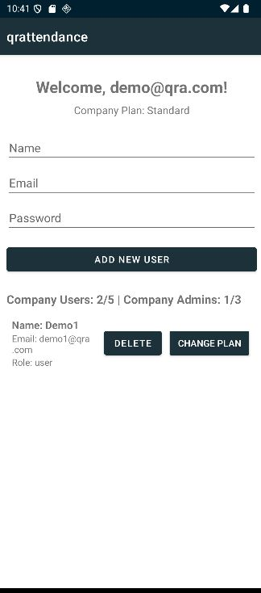  
Admins can view and manage user profiles and QR assignments.

---

## 🧭 Location Selection & Geo-fencing

Operators select the current event location from a dropdown menu.  
The app checks if the operator is within the GPS radius of the selected location.

| Step | Screenshot |
|------|------------|
| Location dropdown | 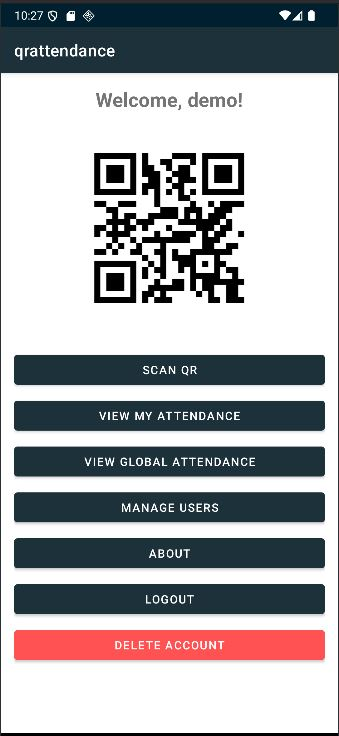 |
| GPS check prompt | 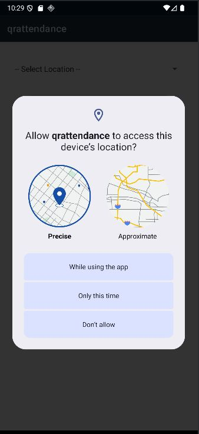 |
| Geo-fence warning | 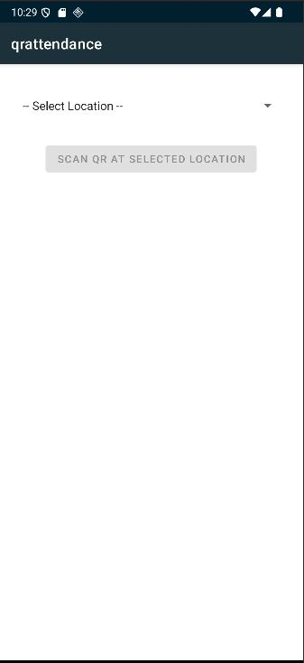 |
| Valid location confirmation | 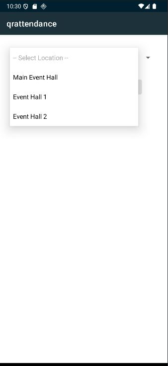 |

---

## 📷 QR Code Scanning

Once location is validated, the operator scans the user’s QR code.

| Step | Screenshot |
|------|------------|
| QR scan interface | 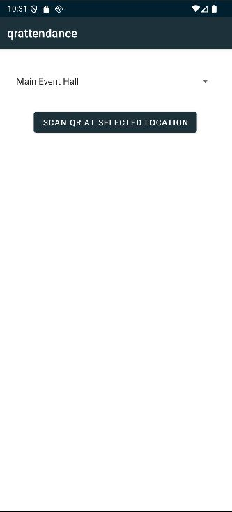 |
| Scan in progress | 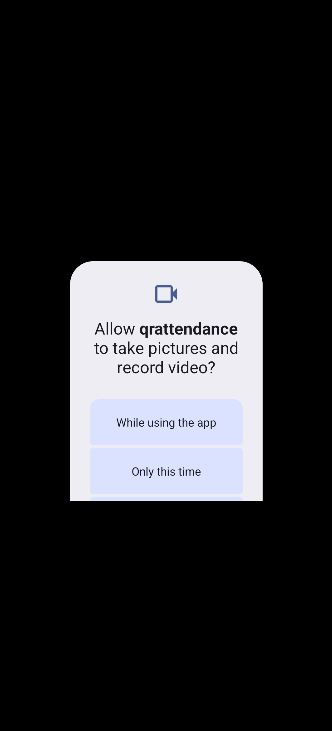 |
| Scan success | 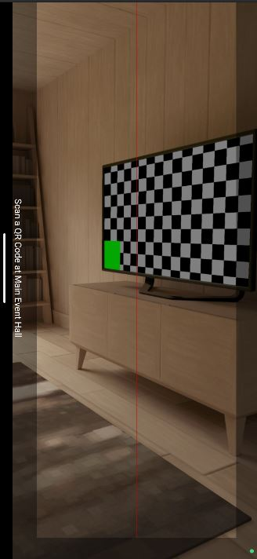 |
| Attendance confirmation | 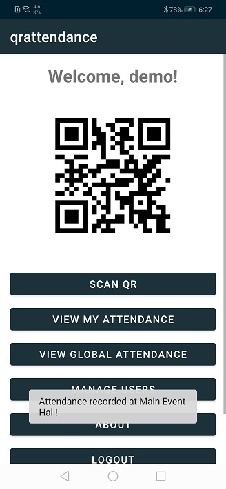 |
| Attendance out of range | 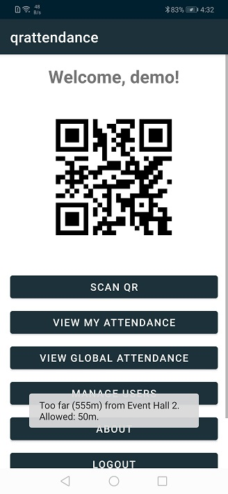 |

---

## 🧾 Data Logged to Firebase

Each attendance record includes:

- `scannedUserId` – ID of the attendee  
- `scannerUserId` – ID of the operator  
- `timestamp` – Date and time of scan  
- `latitude` & `longitude` – Operator’s GPS location  
- `eventLocation` – Selected location name

Stored in:

- `attendance_logs/{scannedUserId}/{uniquePushId}`  
- `global_attendance_log/{uniquePushId}`

---

## 📅 View Attendance History

| View Type | Screenshot |
|-----------|------------|
| My Attendance | 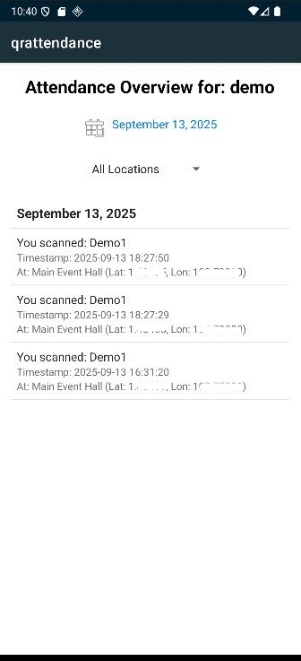 |
| Global Attendance | 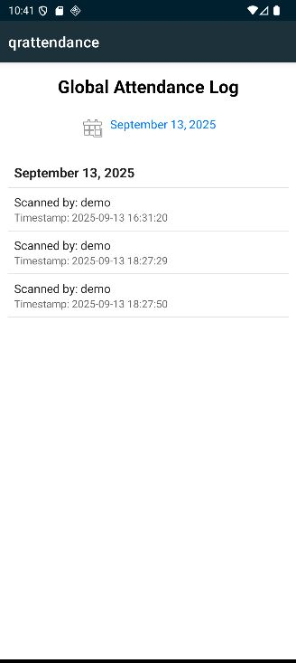 |

Users can view their attendance history filtered by date and location. Admins can access global logs for reporting and audit.

---

## 🎯 Why Clients Love It

- ✅ No fake check-ins  
- ✅ Easy setup and secure scanning  
- ✅ Real-time data for reporting  
- ✅ Works great for events, schools, and teams

---

